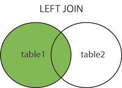
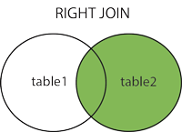
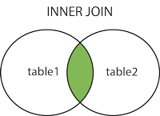

# csvJoins
Small python script for performing different join operations on CSV files.

This script can perform left, right, inner, and full outer joins on two arbitrary CSV files.
It takes two filenames, and the column names of the columns to use as the primary key values.
It requires all the values in each primary key column to be unique. 

## Usage

```
usage: join.py [-h] [-v] [-t {left,right,inner,full}]
               leftFn leftPK rightFn rightPK outputFn

CSV join script

positional arguments:
  leftFn                Filename of left table
  leftPK                Name of column to use as the primary key for the left
                        table
  rightFn               Filename of the right table
  rightPK               Name of column to use as the primary key for the right
                        table
  outputFn              Output filename

optional arguments:
  -h, --help            show this help message and exit
  -v, --verbose         Show output from latex and dvipng commands
  -t {left,right,inner,full}, --type {left,right,inner,full}
                        Type of join (default is 'left join')
```

# Examples

The following are examples that operate on the "a.csv" and "b.csv" files (shown below).

The example images are taken from this stackoverflow post: [http://stackoverflow.com/questions/17946221/sql-join-and-different-types-of-joins](http://stackoverflow.com/questions/17946221/sql-join-and-different-types-of-joins).

### a.csv

```
a,b,c,d,e
97,38,15,7,23
8,41,15,85,50
83,94,10,84,21
43,29,68,87,4
85,54,37,7,24
```

### b.csv

```
l,m,n,o,p
12,18,9,54,76
24,92,61,42,9
26,72,62,14,23
53,61,49,92,26
16,83,53,41,75

```

## Left Join



`python join.py a.csv "a" b.csv "m" output.csv -t left`

```
a,b,c,d,e,l,m,n,o,p
97,38,15,7,23,null,null,null,null,null
8,41,15,85,50,null,null,null,null,null
83,94,10,84,21,16,83,53,41,75
43,29,68,87,4,null,null,null,null,null
85,54,37,7,24,null,null,null,null,null
```

## Right Join



`python join.py a.csv "a" b.csv "m" output.csv -t right`

```
a,b,c,d,e,l,m,n,o,p
null,null,null,null,null,12,18,9,54,76
null,null,null,null,null,24,92,61,42,9
null,null,null,null,null,26,72,62,14,23
null,null,null,null,null,53,61,49,92,26
83,94,10,84,21,16,83,53,41,75
```

## Inner Join



`python join.py a.csv "a" b.csv "m" output.csv -t inner`

```
a,b,c,d,e,l,m,n,o,p
83,94,10,84,21,16,83,53,41,75
```

## Full Outer Join


`python join.py a.csv "a" b.csv "m" output.csv -t full`

```
a,b,c,d,e,l,m,n,o,p
null,null,null,null,null,12,18,9,54,76
43,29,68,87,4,null,null,null,null,null
null,null,null,null,null,53,61,49,92,26
null,null,null,null,null,26,72,62,14,23
8,41,15,85,50,null,null,null,null,null
83,94,10,84,21,16,83,53,41,75
null,null,null,null,null,24,92,61,42,9
97,38,15,7,23,null,null,null,null,null
85,54,37,7,24,null,null,null,null,null
```